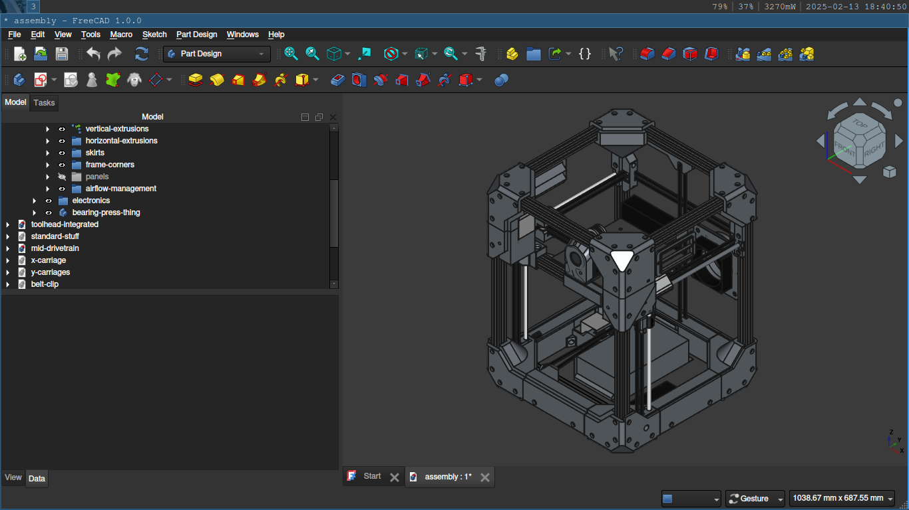

# corexy vslot 3d-printer

The [corexy motion system](https://corexy.com/) is not only useful because of its small
moving mass, but also because of the compact and easily enclosable form factor,
but all the popular diy printers that use it are kind of expensive.
So I designed a corexy 3d printer that has most of the common features of a modern enclosed
machine while trying to keep it affordable.

Caution! This printer is still in active development and not yet thoroughly tested.

The general goals of this project are:
- good print quality at 20mm^3/s 0.5mm width 0.25mm height
- able to print PLA, PETG and ABS reliably
- (180mm)^3 build volume
- easy to build and maintain
- as affordable as possible
- as compact as possible
- have an exaust/filter system
- be as quiet as possible

specs:
- frame
    - size: 356mm * 356mm * 456mm outer dimensions
    - made out of 2020 v-slot aluminium extrusions
    - panels can be lasercut out of 3mm MDF and/or acrylic
    - easy to assemble 3d printed frame corners
    - z-motion system integrated in bottom corners and skirts

- motion system
    - xy-motors at the front move for belt tesnioning
    - 3-point belt driven z-axis, only 1 stepper
    - 250mm * 8mm linear rods for y- and z-axis
    - 250mm mgn9h for x-axis
    - (180mm)^3 build volume

- toolhead
    - bondtech extruder gears, 36mm stepper
    - tz 2.0 bambulab clone hotend
    - inductive bed probe                                   (in development)
    - ebb36 toolhead board                                  (in development)

- air management
    - 80mm air exhaust port (possible to attatch filter)
    - 12032 radial fan 22mm cpap part cooling               (in development)
    - active 65W heater                                     (in development)

- electronics
    - Klipper running on rpi zero 2 W
    - mainboard: skr mini e3 v2.0
    - cheap 24V 10A PSU
    - custom CAN BUS board for active heater                (in development)

The BOM is a libreoffice spreadsheet document called BOM.ods.
I have included links to where i buy the parts. Depending on where you live you might
need to find another supplier though. The material costs are at roughly 320 Eur and can vary
depending on whether you buy in bulk or just for one printer.

## CAD software
This project uses FreeCAD. All the CAD files are in the CAD folder.
Currently there are no plugins you need to install to open any of the CAD files.
There is one main assembly file where all the parts of the printer are integrated.
You can't just download the assembly.FCStd file because it uses links to integrate all the other
sub-assemblies or parts from the other files. You have to download the whole repository (or the CAD folder)
in order to open the main assembly file.
